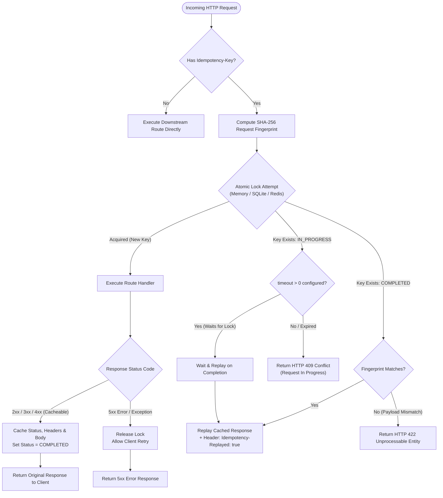

<div align="center">

# FastAPI Idempotency Key 🛡️

[](https://github.com/fastapi-idempotency-key/fastapi-idempotency-key/actions/workflows/test.yml)
[](https://pypi.org/project/fastapi-idempotency-key/)
[](https://pypi.org/project/fastapi-idempotency-key/)
[](https://opensource.org/licenses/MIT)
[](https://github.com/fastapi-idempotency-key/fastapi-idempotency-key)
[](https://github.com/psf/black)
[](https://mypy-lang.org/)

**Stripe-grade `Idempotency-Key` engine for FastAPI and Starlette APIs.**<br>
Guaranteed exactly-once execution, deterministic SHA-256 fingerprinting, atomic distributed locks, and pluggable backends (Memory, SQLite, Redis).

</div>

---

## 📖 Table of Contents

- [The Problem: Why Idempotency Matters](#-the-problem-why-idempotency-matters)
- [How It Works](#-how-it-works)
- [Key Features](#-key-features)
- [Architecture & Flow](#-architecture--flow)
- [Installation](#-installation)
- [Quick Start](#-quick-start)
  - [1. Global ASGI Middleware](#1-global-asgi-middleware)
  - [2. Route-Level Decorator](#2-route-level-decorator)
- [Storage Backends Comparison](#-storage-backends-comparison)
  - [MemoryBackend](#1-memorybackend)
  - [SQLiteBackend](#2-sqlitebackend)
  - [RedisBackend](#3-redisbackend)
- [Configuration & API Reference](#-configuration--api-reference)
  - [IdempotencyMiddleware](#idempotencymiddleware)
  - [@idempotent Decorator](#idempotent-decorator)
- [Error Handling & HTTP Status Codes](#-error-handling--http-status-codes)
- [Contributing & Testing](#-contributing--testing)
- [License](#-license)

---

## 💥 The Problem: Why Idempotency Matters

In distributed systems, networks are inherently unreliable. When clients interact with payment gateways, order processing systems, or webhook dispatchers, network partitions, socket timeouts, or retry mechanisms can duplicate incoming mutating HTTP requests (`POST`, `PUT`, `PATCH`).

Without server-side idempotency safeguards:
- **Double Charges**: A customer clicks "Pay" twice or a mobile connection drops, causing payment processors to execute duplicate charges.
- **Duplicate Orders**: An e-commerce service creates multiple fulfillment tickets for a single checkout.
- **Webhook Storms**: Payment providers (Stripe, Adyen, PayPal) retry webhooks until an HTTP 200 is acknowledged, causing repeated side effects.

`fastapi-idempotency-key` implements the [IETF HTTP Idempotency-Key specification](https://datatracker.ietf.org/doc/draft-ietf-httpapi-idempotency-key-header/) and Stripe's battle-tested idempotency model. It turns your mutating endpoints into resilient, replayable operations with zero architectural friction.

---

## ⚙️ How It Works

1. **Request Interception**: Incoming requests are checked for an `Idempotency-Key` header (e.g. `Idempotency-Key: e8a78bf5-4f40-42bf-9076-2f6cfd939634`).
2. **Fingerprint Calculation**: A deterministic SHA-256 hash is computed across the HTTP method, normalized URL path, sorted query parameters, and raw request body.
3. **Atomic Mutual Exclusion**: An atomic lock is claimed in the storage backend (Memory, SQLite WAL, or Redis Lua script).
4. **Three Execution Outcomes**:
   - **First Arrival (Lock Acquired)**: Downstream FastAPI route executes normally. The completed HTTP status code, response headers, and response body are atomically cached with a TTL.
   - **Concurrent Duplicate (In Flight)**: If another request with the same key is currently running, the server rejects it with **HTTP 409 Conflict** (or optionally blocks up to `timeout` seconds to await completion).
   - **Subsequent Duplicate (Completed)**: If the request was previously executed, the exact cached response is replayed with an `Idempotency-Replayed: true` header.
5. **Mismatch Protection**: If an existing key is reused with a different payload or query parameters, the server blocks execution and immediately responds with **HTTP 422 Unprocessable Entity**.
6. **Automatic Fault Tolerance**: If your application crashes or returns a 5xx server error, the lock is automatically released so the client can safely retry without waiting for the TTL to expire.

---

## 📊 Architecture & Flow



---

## ✨ Key Features

- **Strict Exactly-Once Semantics**: Completely eliminates race conditions and duplicate operations under high concurrency.
- **Atomic Concurrency Protection**: High-concurrency protection via `asyncio.Lock` (Memory), atomic transactions in WAL mode (SQLite), or single-roundtrip atomic Lua scripts (Redis).
- **Deterministic SHA-256 Fingerprinting**: Detects request tampering, altered bodies, or mismatched query parameters.
- **Zero-Loss Replay Engine**: Transparently captures and replays status codes, custom headers, JSON payloads, binary blobs, and `StreamingResponse` objects.
- **Fail-Safe Exception Recovery**: Unhandled Python exceptions or 500 server errors immediately release locks, allowing client retries without waiting for expiration.
- **Flexible Integration**: Apply globally as an ASGI middleware (`IdempotencyMiddleware`) or selectively on individual endpoints via `@idempotent`.
- **Zero External Dependencies Required**: Core functionality works out-of-the-box using pure Python and Starlette.
- **100% Type-Annotated**: Full `mypy --strict` compliance and `py.typed` marker included.

---

## 📦 Installation

```bash
# Core package (in-memory backend included)
pip install fastapi-idempotency-key

# With Redis backend support
pip install "fastapi-idempotency-key[redis]"

# With SQLite backend support
pip install "fastapi-idempotency-key[sqlite]"

# With all backend drivers
pip install "fastapi-idempotency-key[all]"
```

---

## 🚀 Quick Start

### 1. Global ASGI Middleware

Protect all mutating endpoints (`POST`, `PUT`, `PATCH`) across your entire application in under 30 seconds:

```python
from fastapi import FastAPI
from fastapi_idempotency_key import IdempotencyMiddleware, MemoryBackend

app = FastAPI(title="Payment API")

# Register middleware with in-memory storage (24-hour TTL)
app.add_middleware(
    IdempotencyMiddleware,
    backend=MemoryBackend(),
    header_name="Idempotency-Key",
    default_ttl=86400,
)

@app.post("/payments")
async def create_payment(payment: dict):
    # Guaranteed to execute exactly once per Idempotency-Key!
    return {"status": "paid", "amount": payment["amount"]}
```

Test it with `curl`:
```bash
# First request: Executes handler
curl -i -X POST http://localhost:8000/payments \
  -H "Idempotency-Key: pay_unique_987" \
  -H "Content-Type: application/json" \
  -d '{"amount": 100}'

# Second request with same key: Replayed immediately from cache
curl -i -X POST http://localhost:8000/payments \
  -H "Idempotency-Key: pay_unique_987" \
  -H "Content-Type: application/json" \
  -d '{"amount": 100}'
# -> Returns HTTP 200 with header: "Idempotency-Replayed: true"

# Tampered request with same key but different amount:
curl -i -X POST http://localhost:8000/payments \
  -H "Idempotency-Key: pay_unique_987" \
  -H "Content-Type: application/json" \
  -d '{"amount": 250}'
# -> Returns HTTP 422 Unprocessable Entity
```

---

### 2. Route-Level Decorator

Target only high-risk routes (e.g. checkout, refunds) without applying idempotency globally:

```python
from fastapi import FastAPI, Request
from fastapi_idempotency_key import idempotent, MemoryBackend

app = FastAPI()
backend = MemoryBackend()

@app.post("/checkout")
@idempotent(backend=backend, expire=300, required=True)
async def checkout(payload: dict, request: Request):
    return {"order_id": "ord_123", "status": "confirmed"}

@app.post("/cart/items")
async def add_to_cart(item: dict):
    # Standard endpoint: not idempotent
    return {"status": "added", "item": item}
```

---

## 🗄️ Storage Backends Comparison

| Feature | `MemoryBackend` | `SQLiteBackend` | `RedisBackend` |
| :--- | :---: | :---: | :---: |
| **Persistence** | In-Memory (Volatile) | Disk / File / `:memory:` | Memory / RDB / AOF |
| **Multi-Process Safe** | Single Process | Multi-Process (WAL Mode) | Distributed Multi-Worker |
| **Locking Mechanism** | `asyncio.Lock` | SQLite Immediate Transactions | Atomic Redis Lua Scripts |
| **Eviction / TTL** | In-memory LRU + TTL Purge | SQLite Index + On-demand TTL | Native Redis Key TTL |
| **Setup Overhead** | Zero Dependencies | `aiosqlite` | `redis-py` (asyncio) |
| **Ideal Use Case** | Testing, Local Dev, Micro-apps | Single-node servers, Embedded APIs | Distributed microservices, Kubernetes |

### 1. `MemoryBackend`

```python
from fastapi_idempotency_key import MemoryBackend

# Keep up to 10,000 keys in memory with LRU eviction
backend = MemoryBackend(max_keys=10_000)
```

### 2. `SQLiteBackend`

Thread-safe and process-safe persistent storage using `aiosqlite` with Write-Ahead Logging (WAL) enabled:

```python
from fastapi_idempotency_key import SQLiteBackend

# Persistent SQLite database file
backend = SQLiteBackend(database_path="idempotency.db")
```

### 3. `RedisBackend`

Enterprise-scale distributed storage with atomic single-flight Lua scripts:

```python
from fastapi_idempotency_key import RedisBackend

# Connect via connection string
backend = RedisBackend(redis_url="redis://localhost:6379/0", prefix="myapp:idempotency:")

# Or pass an existing redis.asyncio.Redis instance:
import redis.asyncio as aioredis

redis_client = aioredis.from_url("redis://localhost:6379/0")
backend = RedisBackend(redis=redis_client)
```

---

## 🛠️ Configuration & API Reference

### `IdempotencyMiddleware`

| Parameter | Type | Default | Description |
| :--- | :--- | :--- | :--- |
| `app` | `ASGIApp` | *Required* | Downstream ASGI application. |
| `backend` | `BaseIdempotencyBackend` | `MemoryBackend()` | Storage backend instance. |
| `header_name` | `str` | `"Idempotency-Key"` | Case-insensitive header name for client keys. |
| `replay_header_name` | `str` | `"Idempotency-Replayed"` | Header set to `"true"` on replayed responses. |
| `enforce_methods` | `Tuple[str, ...]` | `("POST", "PATCH", "PUT")` | HTTP verbs subjected to idempotency enforcement. |
| `default_ttl` | `int` | `86400` | Expiration time for cached responses (in seconds). |
| `timeout` | `float` | `0.0` | Maximum seconds to wait for an in-progress request before returning 409 Conflict. |
| `cache_statuses` | `Tuple[int, ...]` | `(200, 201, 202, 204, ...)` | HTTP status codes that will be persisted and replayed. |
| `on_conflict_status`| `int` | `409` | Status code returned on concurrent in-progress duplicate. |
| `on_mismatch_status`| `int` | `422` | Status code returned on payload mismatch. |
| `required` | `bool` | `False` | When `True`, returns HTTP 400 if the header is missing. |

---

### `@idempotent` Decorator

| Parameter | Type | Default | Description |
| :--- | :--- | :--- | :--- |
| `expire` | `int` | `86400` | TTL in seconds for the cached response. |
| `header_name` | `str` | `"Idempotency-Key"` | Header name to inspect. |
| `replay_header_name`| `str` | `"Idempotency-Replayed"` | Header attached to replayed responses. |
| `backend` | `Optional[BaseIdempotencyBackend]` | `None` | Storage backend (defaults to global memory store). |
| `required` | `bool` | `False` | Raise `IdempotencyKeyMissingError` (HTTP 400) if absent. |
| `timeout` | `float` | `0.0` | Seconds to wait for concurrent requests. |
| `cache_statuses` | `Tuple[int, ...]` | `(200, 201, 202, 204, ...)` | Status codes to cache. |

---

## 🚨 Error Handling & HTTP Status Codes

| HTTP Status | Condition | Example Response Body |
| :---: | :--- | :--- |
| **`409 Conflict`** | Another request with the same key is currently running. | `{"detail": "A request with this idempotency key is currently in progress."}` |
| **`422 Unprocessable`** | Key was previously used with a different body, path, or query string. | `{"detail": "Idempotency key was previously used with a different request payload."}` |
| **`400 Bad Request`** | `required=True` is enabled and client omitted the header. | `{"detail": "Idempotency-Key header is required."}` |
| **`5xx Server Error`** | Upstream handler failed; lock is released to allow client retry. | Normal upstream server error representation. |

---

## 🧪 Contributing & Testing

We uphold strict quality gates with 99%+ test coverage and comprehensive static analysis.

```bash
# Clone the repository
git clone https://github.com/fastapi-idempotency-key/fastapi-idempotency-key.git
cd fastapi-idempotency-key

# Create and activate virtual environment
python3 -m venv .venv
source .venv/bin/activate

# Install development dependencies
pip install -e ".[all,dev]"

# Run tests with coverage
pytest --cov=fastapi_idempotency_key --cov-report=term-missing

# Run code formatters and linters
black --check fastapi_idempotency_key tests examples
flake8 fastapi_idempotency_key tests examples
mypy fastapi_idempotency_key tests examples
```

---

## 📄 License

This project is licensed under the terms of the [MIT License](LICENSE).
