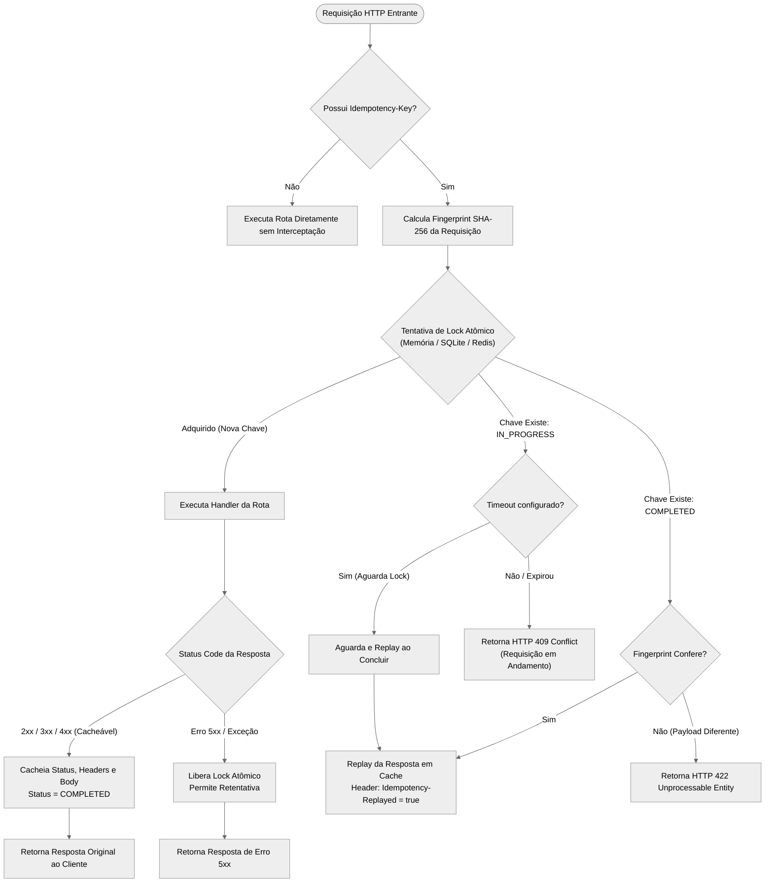

<div align="center">

# FastAPI Idempotency Key 🛡️

[](https://github.com/Luan1Schons/fastapi-idempotency-key/actions/workflows/test.yml)
[](https://pypi.org/project/fastapi-idempotency-key/)
[](https://pypi.org/project/fastapi-idempotency-key/)
[](https://opensource.org/licenses/MIT)
[](https://github.com/Luan1Schons/fastapi-idempotency-key)
[](https://github.com/psf/black)
[](https://mypy-lang.org/)

**Mecanismo de `Idempotency-Key` de padrão bancário (Stripe-grade) para APIs FastAPI e Starlette.**<br>
Execução garantida exatamente uma vez (*exactly-once*), fingerprinting determinístico com SHA-256, distributed locks atômicos e backends plugáveis (Memory, SQLite e Redis).

<p align="center">
  <b><a href="README.md">English</a></b> • <b><a href="README.pt-BR.md">Português (Brasil)</a></b>
</p>

</div>

---

## 📖 Sumário

- [💥 O Problema: Por que Idempotência é Crítica?](#-o-problema-por-que-idempotência-é-crítica)
- [🛡️ A Solução: O Motor de Idempotência Padrão Stripe](#️-a-solução-o-motor-de-idempotência-padrão-stripe)
- [🎯 Aplicações Práticas no Mundo Real](#-aplicações-práticas-no-mundo-real)
- [⚙️ Como Funciona por Baixo dos Panos](#️-como-funciona-por-baixo-dos-panos)
- [📊 Arquitetura & Fluxo](#-arquitetura--fluxo)
- [✨ Principais Recursos](#-principais-recursos)
- [📦 Instalação](#-instalação)
- [🚀 Início Rápido](#-início-rápido)
  - [1. Middleware ASGI Global](#1-middleware-asgi-global)
  - [2. Decorator Granular por Rota](#2-decorator-granular-por-rota)
- [🗄️ Comparativo de Backends de Armazenamento](#️-comparativo-de-backends-de-armazenamento)
  - [MemoryBackend](#1-memorybackend)
  - [SQLiteBackend](#2-sqlitebackend)
  - [RedisBackend](#3-redisbackend)
- [🛠️ Configurações & Referência de API](#️-configurações--referência-de-api)
  - [IdempotencyMiddleware](#idempotencymiddleware)
  - [Decorator @idempotent](#decorator-idempotent)
- [🚨 Tratamento de Erros & Status Codes HTTP](#-tratamento-de-erros--status-codes-http)
- [🧪 Contribuição & Testes](#-contribuição--testes)
- [📄 Licença](#-licença)

---

## 💥 O Problema: Por que Idempotência é Crítica?

Em sistemas distribuídos, **a rede é inerentemente não confiável**. Imagine um endpoint de checkout de pagamento: `POST /api/v1/checkout`.

```
[App / Cliente]                   [Servidor FastAPI]               [Gateway de Pagamento / DB]
      |                                   |                                     |
      |---- 1. POST /checkout ----------->|                                     |
      |    (Header: Idempotency-Key)      |---- 2. Cobrar R$ 500 -------------->|
      |                                   |<--- 3. Cobrança Efetuada -----------|
      |                                   |
      |  x-- 4. Queda de conexão! -------x|  (O cliente nunca recebe o HTTP 200)
      |     (ou timeout no 4G móvel)
      |
      |---- 5. Retry / Clique Duplo! ---->|
      |    (Axios/SDK retenta sozinho)    |---- 6. COBRANÇA DUPLICADA! -------->|  💥 PREJUÍZO!
```

### O Cenário Real:
1. O usuário clica em **"Finalizar Pedido"**.
2. O servidor processa o pagamento (R$ 500 debitados do cartão) e grava o pedido no banco.
3. No exato instante em que o servidor ia responder `HTTP 200 OK`, a conexão 4G do celular do usuário oscila por 200ms ou ocorre um timeout de gateway.
4. O frontend do cliente (ou biblioteca como Axios, React Query ou SDK móvel) assume que a requisição falhou e **tenta novamente de forma automática (retry)**. Ou o usuário em pânico clica duas vezes no botão.
5. **O Desastre**: Sem proteção de idempotência no servidor, a API executa a rota novamente, **cobrando mais R$ 500 do cliente (R$ 1.000 no total)** e duplicando notas fiscais e separação de estoque.

> Pela especificação HTTP, métodos como `GET`, `PUT` e `DELETE` são naturalmente idempotentes. Mas o **`POST` não é**. Sem idempotência no backend, efeitos colaterais duplicados, cobranças indevidas e condições de corrida (*race conditions*) ocorrem diariamente em produção.

---

## 🛡️ A Solução: O Motor de Idempotência Padrão Stripe

A **`fastapi-idempotency-key`** implementa a especificação oficial [IETF HTTP Idempotency-Key draft](https://datatracker.ietf.org/doc/draft-ietf-httpapi-idempotency-key-header/) e o padrão de engenharia utilizado por gigantes globais como Stripe e PayPal.

Quando o cliente envia o header `Idempotency-Key` (normalmente um UUID v4 gerado no cliente):

1. **Primeira Chegada**: Um lock atômico é adquirido. Sua rota FastAPI executa normalmente. O status code (`200 OK`), headers da resposta e o corpo de retorno são cacheados atomicamente com um TTL configurável.
2. **Retentativas ou Requisições Duplicadas**: O código da sua rota **não roda novamente**. A resposta original em cache é devolvida em `< 1ms` com o header `Idempotency-Replayed: true`. Zero cobrança duplicada, zero efeito colateral.
3. **Proteção contra Condição de Corrida**: Se duas requisições com a mesma chave chegarem no mesmo milissegundo, a primeira adquire o lock e a segunda é rejeitada imediatamente com **`HTTP 409 Conflict`** (ou aguarda a conclusão se `timeout` estiver configurado).
4. **Proteção contra Violação de Payload**: Se um cliente tentar reutilizar a mesma chave com parâmetros ou corpo de requisição diferentes, a API bloqueia a execução com **`HTTP 422 Unprocessable Entity`**.
5. **Tolerância a Falhas Automática**: Se seu servidor disparar uma exceção não tratada ou erro 500, o lock é liberado automaticamente para permitir que o cliente retente quando o serviço se restabelecer.

---

## 🎯 Aplicações Práticas no Mundo Real

- 💳 **Fintechs & Gateways de Pagamento**: Cobranças de cartão, transferências instantâneas via PIX, emissão de boletos e estornos.
- 🛍️ **E-commerce & Marketplaces**: Criação de pedidos, reserva de estoque e resgate de cupons de uso único.
- ⚡ **Receptores de Webhooks**: Provedores de serviços (Stripe, GitHub, Shopify, Mercado Pago) reenviam webhooks de 5 a 10 vezes até obter HTTP 200. A lib garante processamento único (*exactly-once*).
- 📨 **Filas de Mensagens e Microsserviços**: Consumidores de mensageria (Kafka, RabbitMQ, Celery) que operam com garantias de entrega *at-least-once*.
- 📱 **Aplicativos Mobile**: Ambientes com conexões móveis instáveis (túneis, elevadores, áreas rurais) propensos a desconexões súbitas.

---

## ⚙️ Como Funciona por Baixo dos Panos

1. **Interceptação de Requisição**: A requisição de entrada é inspecionada em busca do cabeçalho `Idempotency-Key` (ex: `Idempotency-Key: e8a78bf5-4f40-42bf-9076-2f6cfd939634`).
2. **Fingerprinting Determinístico**: Um hash SHA-256 é calculado a partir do método HTTP, path normalizado da URL, query params ordenados e corpo bruto (*raw body*) da requisição.
3. **Exclusão Mútua Atômica**: Um lock atômico é adquirido no backend configurado (Memória com asyncio.Lock, SQLite em modo WAL ou script Lua atômico no Redis).
4. **Três Cenários de Execução**:
   - **Primeira Chegada (Lock Adquirido)**: A rota FastAPI downstream executa normalmente. O status HTTP, headers e corpo de resposta são cacheados atomicamente com TTL.
   - **Duplicata Concorrente (Em Voo)**: Se outra requisição com a mesma chave estiver em execução, é rejeitada com **HTTP 409 Conflict** (ou bloqueia até `timeout` segundos para aguardar a conclusão).
   - **Duplicata Posterior (Concluída)**: Se a requisição já tiver sido finalizada anteriormente, a resposta em cache é devolvida com o header `Idempotency-Replayed: true`.
5. **Proteção contra Mismatch**: Se a mesma chave for reutilizada com outro payload, a execução é interrompida com **HTTP 422 Unprocessable Entity**.
6. **Recuperação de Falhas**: Se a aplicação falhar com erro 5xx, o lock é liberado automaticamente.

---

## 📊 Arquitetura & Fluxo



---

## ✨ Principais Recursos

- **Semântica Estrita Exactly-Once**: Elimina operações duplicadas e race conditions sob alta concorrência.
- **Proteção de Concorrência Atômica**: `asyncio.Lock` (Memória), transações atômicas imediatas em modo WAL (SQLite) ou scripts Lua em viagem única no Redis.
- **Fingerprinting SHA-256**: Detecta adulteração de corpo, parâmetros e URLs modificadas com a mesma chave.
- **Motor de Replay Zero-Loss**: Captura e reproduz status codes, headers customizados, JSONs, dados binários e objetos `StreamingResponse`.
- **Recuperação contra Falhas**: Erros 500 ou exceções Python liberam o lock imediatamente para retentativas seguras.
- **Integração Flexível**: Use globalmente como Middleware ASGI (`IdempotencyMiddleware`) ou de forma granular via `@idempotent`.
- **Zero Dependências Obrigatórias**: O core funciona nativamente em Python puro e Starlette.
- **100% Tipado**: Compatível com `mypy --strict` e marcador PEP 561 `py.typed`.

---

## 📦 Instalação

```bash
# Pacote base (backend em memória incluso, zero dependências externas)
pip install fastapi-idempotency-key

# Com suporte a Redis
pip install "fastapi-idempotency-key[redis]"

# Com suporte a SQLite
pip install "fastapi-idempotency-key[sqlite]"

# Com todos os drivers de backends
pip install "fastapi-idempotency-key[all]"
```

---

## 🚀 Início Rápido

### 1. Middleware ASGI Global

Proteja todos os endpoints mutantes (`POST`, `PUT`, `PATCH`) em toda a sua aplicação em menos de 30 segundos:

```python
from fastapi import FastAPI
from fastapi_idempotency_key import IdempotencyMiddleware, MemoryBackend

app = FastAPI(title="Payment API")

# Registra o middleware com armazenamento em memória (TTL de 24 horas)
app.add_middleware(
    IdempotencyMiddleware,
    backend=MemoryBackend(),
    header_name="Idempotency-Key",
    default_ttl=86400,
)

@app.post("/payments")
async def create_payment(payment: dict):
    # Execução garantida de apenas uma vez por Idempotency-Key!
    return {"status": "paid", "amount": payment["amount"]}
```

Teste via `curl`:
```bash
# 1. Primeira requisição: Executa o handler normalmente
curl -i -X POST http://localhost:8000/payments \
  -H "Idempotency-Key: pay_unique_987" \
  -H "Content-Type: application/json" \
  -d '{"amount": 100}'

# 2. Segunda requisição com a mesma chave: Devolvida imediatamente do cache (<1ms)
curl -i -X POST http://localhost:8000/payments \
  -H "Idempotency-Key: pay_unique_987" \
  -H "Content-Type: application/json" \
  -d '{"amount": 100}'
# -> Retorna HTTP 200 com o header: "Idempotency-Replayed: true"

# 3. Requisição adulterada com mesma chave e payload diferente:
curl -i -X POST http://localhost:8000/payments \
  -H "Idempotency-Key: pay_unique_987" \
  -H "Content-Type: application/json" \
  -d '{"amount": 250}'
# -> Retorna HTTP 422 Unprocessable Entity
```

---

### 2. Decorator Granular por Rota

Proteja apenas rotas sensíveis (ex: checkout, estornos) sem impor idempotência no app inteiro:

```python
from fastapi import FastAPI, Request
from fastapi_idempotency_key import idempotent, MemoryBackend

app = FastAPI()
backend = MemoryBackend()

@app.post("/checkout")
@idempotent(backend=backend, expire=300, required=True)
async def checkout(payload: dict, request: Request):
    return {"order_id": "ord_123", "status": "confirmed"}

@app.post("/cart/items")
async def add_to_cart(item: dict):
    # Rota normal: sem verificação de idempotência
    return {"status": "added", "item": item}
```

---

## 🗄️ Comparativo de Backends de Armazenamento

| Recurso | `MemoryBackend` | `SQLiteBackend` | `RedisBackend` |
| :--- | :---: | :---: | :---: |
| **Persistência** | Memória RAM (Volátil) | Disco / Arquivo / `:memory:` | Memória / RDB / AOF |
| **Multi-Process Safe** | Processo Único | Multi-Processo (Modo WAL) | Distribuído Multi-Worker |
| **Mecanismo de Lock** | `asyncio.Lock` | Transações SQLite Imediatas | Scripts Atômicos Lua no Redis |
| **Expiração / TTL** | LRU em memória + TTL Purge | Índice SQLite + TTL sob demanda | TTL Nativo de Chaves no Redis |
| **Dependências** | Zero Dependências | `aiosqlite` | `redis-py` (asyncio) |
| **Caso de Uso Ideal** | Testes, Dev Local, Micro-apps | Servidores de nó único, APIs embarcadas | Microsserviços distribuídos, Kubernetes |

### 1. `MemoryBackend`

```python
from fastapi_idempotency_key import MemoryBackend

# Mantém até 10.000 chaves em memória com política LRU
backend = MemoryBackend(max_keys=10_000)
```

### 2. `SQLiteBackend`

Armazenamento persistente e seguro entre múltiplos processos usando `aiosqlite` com Write-Ahead Logging (WAL):

```python
from fastapi_idempotency_key import SQLiteBackend

# Arquivo persistente do banco SQLite
backend = SQLiteBackend(database_path="idempotency.db")
```

### 3. `RedisBackend`

Armazenamento distribuído corporativo com scripts atômicos em Lua de viagem única:

```python
from fastapi_idempotency_key import RedisBackend

# Conexão via URL
backend = RedisBackend(redis_url="redis://localhost:6379/0", prefix="myapp:idempotency:")

# Ou passando uma instância existente do redis.asyncio.Redis:
import redis.asyncio as aioredis

redis_client = aioredis.from_url("redis://localhost:6379/0")
backend = RedisBackend(redis=redis_client)
```

---

## 🛠️ Configurações & Referência de API

### `IdempotencyMiddleware`

| Parâmetro | Tipo | Padrão | Descrição |
| :--- | :--- | :--- | :--- |
| `app` | `ASGIApp` | *Obrigatório* | Aplicação ASGI downstream. |
| `backend` | `BaseIdempotencyBackend` | `MemoryBackend()` | Instância do backend de armazenamento. |
| `header_name` | `str` | `"Idempotency-Key"` | Nome do cabeçalho enviado pelo cliente (case-insensitive). |
| `replay_header_name` | `str` | `"Idempotency-Replayed"` | Cabeçalho marcado como `"true"` em respostas reexecutadas do cache. |
| `enforce_methods` | `Tuple[str, ...]` | `("POST", "PATCH", "PUT")` | Verbos HTTP sujeitos a controle de idempotência. |
| `default_ttl` | `int` | `86400` | Tempo de expiração do cache em segundos (padrão: 24h). |
| `timeout` | `float` | `0.0` | Segundos para aguardar requisições concorrentes antes de emitir 409. |
| `cache_statuses` | `Tuple[int, ...]` | `(200, 201, 202, 204, ...)` | Status codes HTTP que serão cacheados e reexecutados. |
| `on_conflict_status`| `int` | `409` | Status code retornado para requisições concorrentes em voo. |
| `on_mismatch_status`| `int` | `422` | Status code retornado quando o payload da mesma chave foi adulterado. |
| `required` | `bool` | `False` | Se `True`, retorna HTTP 400 se o cliente não enviar o header. |

---

### Decorator `@idempotent`

| Parâmetro | Tipo | Padrão | Descrição |
| :--- | :--- | :--- | :--- |
| `expire` | `int` | `86400` | TTL em segundos da resposta em cache. |
| `header_name` | `str` | `"Idempotency-Key"` | Nome do cabeçalho a inspecionar. |
| `replay_header_name`| `str` | `"Idempotency-Replayed"` | Cabeçalho adicionado na resposta de replay. |
| `backend` | `Optional[BaseIdempotencyBackend]` | `None` | Backend de armazenamento (padrão: memória global). |
| `required` | `bool` | `False` | Dispara `HTTP 400 Bad Request` se a chave estiver ausente. |
| `timeout` | `float` | `0.0` | Tempo de espera por requisições concorrentes em segundos. |
| `cache_statuses` | `Tuple[int, ...]` | `(200, 201, 202, 204, ...)` | Status codes cacheados. |

---

## 🚨 Tratamento de Erros & Status Codes HTTP

| Status HTTP | Condição | Exemplo de Resposta |
| :---: | :--- | :--- |
| **`409 Conflict`** | Outra requisição com a mesma chave está em execução simultânea. | `{"detail": "A request with this idempotency key is currently in progress."}` |
| **`422 Unprocessable`** | A chave foi usada anteriormente com outro body, path ou query params. | `{"detail": "Idempotency key was previously used with a different request payload."}` |
| **`400 Bad Request`** | `required=True` habilitado e o cliente não enviou o header. | `{"detail": "Idempotency-Key header is required."}` |
| **`5xx Server Error`** | Erro interno do servidor; lock liberado para permitir retentativa. | Resposta de erro 5xx normal do servidor. |

---

## 🧪 Contribuição & Testes

Mantemos padrões rigorosos com mais de 99% de cobertura de testes e análise estática completa.

```bash
# Clone o repositório
git clone https://github.com/Luan1Schons/fastapi-idempotency-key.git
cd fastapi-idempotency-key

# Crie e ative o ambiente virtual
python3 -m venv .venv
source .venv/bin/activate

# Instale todas as dependências de desenvolvimento
pip install -e ".[all,dev]"

# Execute os testes com relatório de cobertura
pytest --cov=fastapi_idempotency_key --cov-report=term-missing

# Execute linters e checagem estática de tipos
black --check fastapi_idempotency_key tests examples
flake8 fastapi_idempotency_key tests examples
mypy fastapi_idempotency_key tests examples
```

---

## 📄 Licença

Distribuído sob os termos da licença [MIT](LICENSE).
